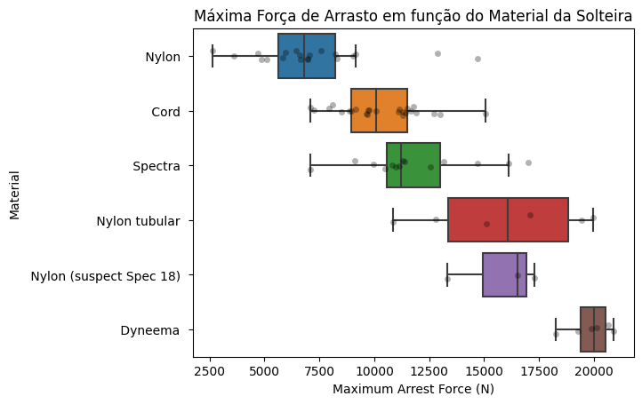
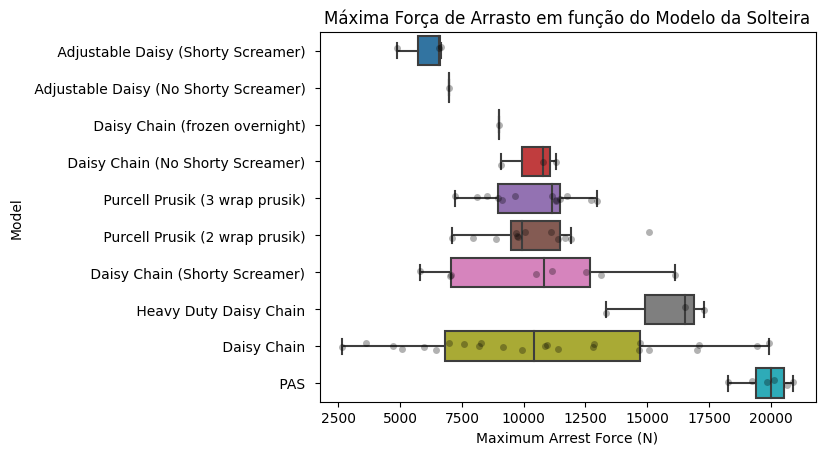
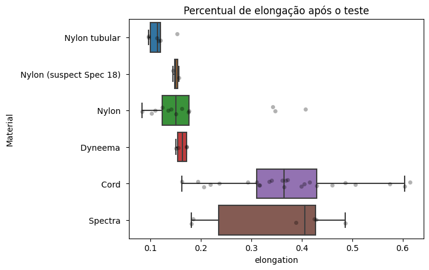
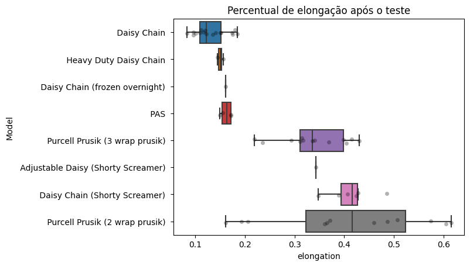
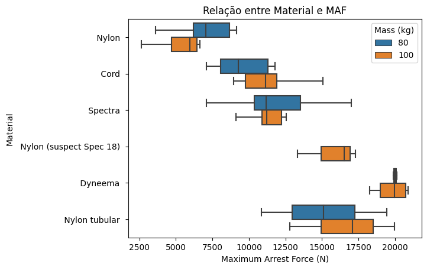
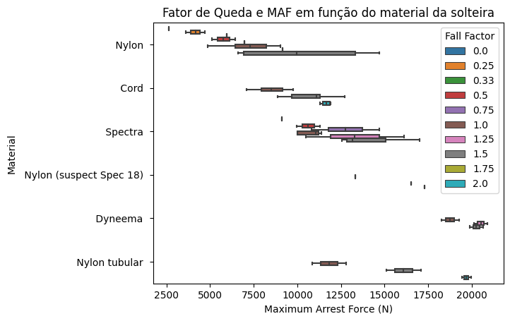
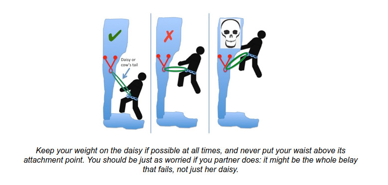

# Como escolher uma solteira de um jeito nerd

Estando em processo de terminar o meu Curso Básico de Montanhismo (CBM), me deparei com a necessidade de comprar os primeiros equipamentos de escalada. Tomar decisões sobre mosquetões, freios, cadeirinha e capacete não foi tão difícil, mas escolher uma solteira me deixou bastante reflexivo. Isso porque, durante o curso, usamos uma MultiChain de Nylon, mas vimos alguns guias que usavam um estranho emaranhado de cordelete (que mais tarde descobri se chamar Purcell Prusik), outros que usavam uma levíssima MultiChain de Dyneema (polietileno) e até gente que se ancorava com a própria corda de escalada, usando a *volta do fiel* para se manter preso à rocha. Contudo, após alguma pesquisa e conversa com escaladores mais experientes (obrigado pela ajuda, Charles!), acabei decidindo usar um Purcell Prusik. Esse texto busca explicar minha decisão quanto a essa escolha.

---
## :warning: Importante! :warning:
Este texto **NÃO é uma recomendação** de que solteira usar.

Este texto descreve apenas o processo de pesquisa que eu, **um aluno do curso básico** (lembre-se disso!), realizei para escolher a minha solteira. Mesmo assim, descreve apenas uma parte desse processo, visto que a minha escolha também envolveu conversas com meus instrutores, com outros escaladores e outras leituras técnicas não citadas aqui. Lembre-se de que a escolha de um equipamento depende de inúmeros outros fatores, sendo a mais importante, talvez, a sua própria experiência. Antes de escolher qualquer equipamento, pesquise, converse e principalmente escale com diferentes materiais para descobrir o que funciona melhor para você, na sua realidade e nas suas condições físicas, emocionais, técnicas e [até financeiras](https://www.spelaionloja.com/esportivo/solteirasautosseguros/connect-adjust-solteira-autosseguro-ajustavel-petzl).

---

## O que é uma solteira e qual sua função
Em primeiro lugar, é preciso dizer que uma *solteira é uma conexão primária entre escalador e rocha*, ou seja, é um equipamento que:

- (i) precisa manter o escalador firmemente conectado à parada;

- (ii) precisa suportar uma queda caso o escalador escorregue sem parti-lo ao meio e sem deixar com que ele bata em algum platô; e

- (iii) precisa continuar funcionando normalmente após a queda (ao se recuperar, o escalador provavelmente continuará escalando. Como ele o fará se a sua solteira estiver danificada?)

Em termos mais técnicos, a solteira precisa absorver o impacto de um tombo com Fator de Queda 1 ([Gibbs, 2005](https://riggingforrescue.com/wp-content/uploads/2017/03/Daisy-Chains-and-Other-Lanyards.pdf)), limitando a força que chega ao escalador - que não pode ser maior do que 12kN (Ver *item 6*, [neste capítulo](http://www.multipitchclimbing.com/)) -, além de não poder se alongar muito e ainda manter-se funcional. Então, como fazer?

## Tipos e material das solteiras
Na minha pesquisa, descobri que há vários formatos de solteira e inúmeros materiais com que são construídas ([Esse livro é um excelente lugar para começar](http://www.multipitchclimbing.com/)). As solteiras mais comuns, me parece, são as MultiChains (ou *Personal Anchor System* - PAS), normalmente feitas de Nylon (poliamida) ou polietileno (*high-modulus polyethylene* - HMPE), geralmente rotuladas pela marca, como Dyneema e Spectra. As solteiras de Nylon são mais volumosas e pesadas, em contraste com as de Dyneema e semelhantes, que são menos volumosas e mais leves.

Além dessas, há muitas pessoas que usam as Daisy Chains como solteiras, apesar de este não ser o seu uso ideal, como mostra [esse vídeo](https://www.youtube.com/watch?v=O1XQZqlTBgo&ab_channel=AltaMontanha) e [essa matéria](https://mojagear.com/shouldnt-use-daisy-chain-personal-anchor/). A própria Black Diamond deixa bem claro [neste artigo](https://www.blackdiamondequipment.com/en_US/stories/experience-story-qc-lab-daisy-chain-dangers-en-glbl/): "Daisy Chains são destinadas ao uso em escalada em artificial e NÃO como parte do seu sistema de ancoragem pessoal" ("*Daisy chains are for aid climbing NOT for use as part of your personal anchor system.*"). (Na página 276 do livro *Mountaineering: The Freedom of the Hills - 7ª Edição*, disponível na biblioteca do CERJ, explica-se o uso das Daisy Chains como parte do conjunto de equipamentos para escalada em artificial.) Estas também são normalmente fabricadas em Nylon ou Dyneema.

Por fim, há ainda solteiras fabricadas pelos próprios escaladores a partir de cordeletes, fazendo o chamado Purcell Prusik, equipamento desenvolvido nos anos 1970 como ferramenta de resgate ([Gibbs, 2005: 05](https://riggingforrescue.com/wp-content/uploads/2017/03/Daisy-Chains-and-Other-Lanyards.pdf)), mas que acabou tendo sua função expandida como sistema de ancoragem primário.

Diante desse cenário, qual seria a melhor opção de solteira? Para responder essa pergunta, fui procurar o que a ciência diz.

## Resultados chocantes dos testes de choque
O artigo de [Gibbs (2005)](https://riggingforrescue.com/wp-content/uploads/2017/03/Daisy-Chains-and-Other-Lanyards.pdf) realiza um conjunto de experimentos com queda livre de massas de 80 kg (simulando um escalador) e 100 kg (simulando um resgatista equipado). O propósito é verificar o pico de força na solteira (que seria transferido para o escalador/resgatista), chamado de MAF (*Maximum Arrest Force*), a elongação da solteira após a queda e o fato de ela ter ou não segurado a queda (ter se rompido).

### Picos de Força
No caso do pico de força, os resultados mostram que o tipo de material está diretamente vinculado a quanta energia é transferida para o escalador. Como mostra o gráfico abaixo, deve-se evitar ao máximo solteiras de Dyneema. Apesar de mais leves e resistentes à água e raios UV, esse material é muito pouco dinâmico, transferindo praticamente toda a força da queda para o escalador. Nos ensaios em questão, as solteiras de Dyneema tiveram picos de força consistentemente em torno de 20.000 kN, muito mais do que os 12.000 kN máximos aceitáveis pelo corpo humano.

No caso do material conhecido como Spectra, apesar de o gráfico mostrar picos de forças mais baixos, isso ocorreu porque a maioria das solteiras desse material se rompeu (54%), como mostra a tabela abaixo.

|                           |Medidos |Falharam  | % de Falha |
|---------------------------|--------|----------|------------|
| Cordelete                 |25      |0         |0           |
| Nylon                     |16      |3         |19          |
| Spectra                   |13      |7         |54          |
| Dyneema                   |6       |2         |33          |
| Nylon tubular             |6       |0         |0           |
| Nylon (suspect Spec 18)   |2       |0         |0           |

A primeira lição que se tira desses dados, portanto, *é evitar solteiras feitas de material estático, como Dyneema e Spectra*. Por mais que seja tentador devido ao peso e volume, uma simples queda pode se tornar perigosa quando segurada por esse tipo de material. Em contrapartida, solteiras de Nylon e/ou de cordeletes (Purcell Prusik) tendem a reduzir os picos de força, além de se romperem com menos facilidade, sendo, portanto, mais seguras.

Quanto ao modelo da solteira, os dados são um pouco confusos, visto que os autores não fizeram um experimento cruzando modelo e material da solteira. O gráfico e a tabela abaixo mostram, respectivamente, os picos de força em cada teste e a porcentagem de falhas (rompimento da solteira). Observe, no gráfico, que PAS (o que chamamos de MultiChain) tem MAF altíssimo. Isso, contudo, provavelmente não advém do fato de ser uma MultiChain, mas do fato de todas as MultiChain testadas serem feitas de Dyneema. Logo, é preciso cuidado ao olhar para esses números.

|                                      |Medidos |Falharam  | % de Falha |
|--------------------------------------|--------|----------|------------|
| Daisy Chain                          |21      |4         |19          |
| Purcell Prusik (3 wrap prusik)       |13      |0         |0           |
| Purcell Prusik (2 wrap prusik)       |12      |0         |0           |
| Daisy Chain (Shorty Screamer)        |8       |2         |25          |
| PAS                                  |6       |2         |33          |
| Adjustable Daisy (Shorty Screamer)   |2       |1         |50          |
| Heavy Duty Daisy Chain               |2       |0         |0           |
| Daisy Chain (No Shorty Screamer)     |2       |2         |1           |
| Adjustable Daisy (No Shorty Screamer)|1       |1         |1           |

Mas algumas coisas se sobressaem. Primeiro, praticamente em todos os casos em que se usou uma Daisy Chain como solteira houve rompimentos. Mesmo com aquelas que tinham um absorvedor de impacto (*Shorty Screamer*) houve quebra do equipamento, como mostram os dados da tabela acima. Outro aspecto curioso é o fato de os picos de força serem tão variáveis nesse tipo de equipamento, podendo ir de 2.500 kN (saudável para o escalador) até 20.000 kN (mortal para o escalador). O autor do artigo não discute em detalhes os métodos usados para prender a carga nessas solteiras, mas de fato elas não parecem ser uma opção consistentemente segura como conexão primária. Testes comparativos mais detalhados, contudo, são necessários para se tirar conclusões mais robustas.

Restaram como opção, então, apenas o Purcell Prusik e a MultiChain de Nylon, que não foi testada neste artigo. O Purcell, como se vê no gráfico, manteve os picos de força em torno dos 10.000 kN, ou seja, dentro de um padrão aceitável para o corpo humano, apesar de alguns testes terem valores mais elevados.
No que diz respeito à variação percentual de tamanho da solteira antes e depois do teste, os resultados mostram que Dyneema é um dos materiais mais consistentemente estáticos, mantendo cerca de apenas 18% de elongação após o teste. Os cordeletes (Purcell Prusik), por outro lado, são os que tiveram mais variação na elongação: vários tendo esticado mais de 50% após a queda. O material conhecido como Spectra, por sua vez, também teve grande variação, mas é preciso lembrar que mais de 50% dessas solteiras não suportaram a queda.

### Percentual de elongação

Se olharmos para esses mesmos dados tendo em vista o modelo da solteira (gráfico abaixo), podemos vislumbrar dois aspectos interessantes. Primeiro, que o absorvedor de impactos (*Shorty Screamer*) ajuda a reduzir a força da queda por meio de uma melhor elongação. Segundo, que o Purcell Prusik com 3 voltas é mais consistente (varia menos) na sua elongação do que o de 2 voltas.

Logo, podemos concluir que, no que diz respeito à elongação, devemos: (i) evitar os materiais que não se esticam (porque transferem muita força para o escalador); e (ii) evitar os materiais que variam muito na elongação (um aumento de 60% no comprimento da solteira pode levar o escalador a se chocar contra um platô, por exemplo). Assim, a melhor opção me parece ser o Purcell Prusik com 3 voltas, que garante uma elongação consistente de cerca de 35%. Estou evitando comentar sobre os equipamentos que usam absorvedor de impacto. Talvez esse material seja comum nas atividades de resgate, mas na escalada por diversão, acredito, seja incomum.

Novamente, não temos o caso de uma solteira MultiChain de Nylon sendo testada, de modo que não podemos concluir nada sobre esse tipo de equipamento.

### Escalador, resgatista e Fator de Queda
Como dito acima, o artigo investiga o efeito, sobre as solteiras, da queda de duas massas distintas: a de 80 kg (simulando um escalador) e a de 100 kg (simulando um resgatista equipado). Nos dados até agora analisados, não separamos esses valores. Apenas a título de curiosidade, fizemos essa distinção no gráfico abaixo.

Observe o caso dos Purcell Prusik (único equipamento fabricado de cordelete): com um escalador (80 kg), o pico de força não ultrapassa os 12.500 kN, ou seja, mesmo no pior cenário - uma improvável queda livre direto da solteira -, a força que chega ao escalador está dentro dos limites do suportável pelo corpo humano.

O mesmo ocorre com o fator de queda. Mesmo diante de fatores de queda altíssimos (1,5 ou 2,0), o Purcell Prusik garante um MAF aceitável e não se rompeu.

## Conclusões
Diante desses dados, e na falta de um estudo que inclua as MultiChains de Nylon nos testes comparativos, a melhor opção de solteira **PARA MIM** me parece ser o Purcell Prusik, de preferência aqueles com 3 voltas. Solteiras de Dyneema e/ou outro tipo de polietileno estão fora de cogitação, já que cair nelas se assemelha a cair pendurado em um cabo de aço: os impactos para o corpo humano serão catastróficos. Daisy Chains, por fim, certamente têm seu propósito (serem usadas em artificial, por exemplo), mas não me pareceram uma boa opção como solteira, visto os testes terem mostrado tantos casos de rompimento, além dos alertas feitos até mesmo pelo fabricante desses equipamentos.

Lembre-se, contudo, que a melhor opção é **evitar colocar-se em situações de risco**. Como alerta [Gibbs, 2005](https://riggingforrescue.com/wp-content/uploads/2017/03/Daisy-Chains-and-Other-Lanyards.pdf), evite ao máximo deixar folgas desnecessárias na sua solteira enquanto ancorado, reduzindo assim os riscos potenciais. Além disso, evite ao máximo colocar-se em uma situação em que uma queda da parada pode ter um fator alto, a saber: quando o escalador (i) estiver na altura da proteção (Fator de Queda igual a 1); e (ii) estiver, por algum motivo, acima da proteção, quando o fator de queda é, pelo menos teoricamente, maior do que 1.

|  |
|:--:|
|Imagem roubada [deste capítulo, item 6](https://people.bath.ac.uk/dac33/high/4Gear.htm). |

#### Observações
Os dados analisados aqui foram raspados do artigo citado (Gibbs, 2005) usando `python` (`pdfquery` e `BeautifulSoup`). Soube do artigo por meio do vídeo do [Vinícius Maltauro](https://www.youtube.com/watch?v=TrxMoUgFuP8&ab_channel=Vin%C3%ADciusMaltauro). Os dados foram reanalisados por mim usando o `pandas` e os gráficos construídos com o `seaborn`. A tabela com os dados pode ser acessada [aqui](https://raw.githubusercontent.com/igordeo-costa/solteira_ideal/main/Gibbs2005.csv) e o código usado pode ser acessado [aqui](https://raw.githubusercontent.com/igordeo-costa/solteira_ideal/main/Solteiras.py). Ficarei feliz em corrigir qualquer erro cometido.
